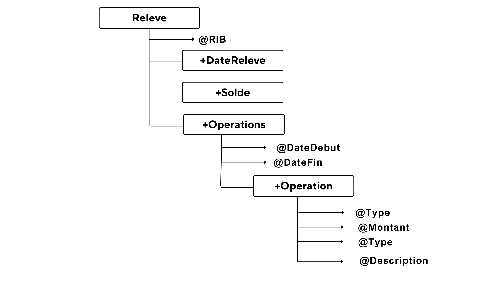

Ce projet permet de gérer des relevés de comptes bancaires en utilisant la technologie XML. Il comprend des fichiers XML pour stocker les données, un DTD et un schéma XML pour valider la structure, ainsi que des feuilles de style XSL pour afficher les données au format HTML.

Fonctionnalités
Structure des données :

Les relevés bancaires sont organisés en fichiers XML.
Chaque relevé contient des opérations de type CREDIT ou DEBIT avec leur date et montant.
Validation des données :

Un DTD est fourni pour définir et valider la structure du document XML.
Un schéma XML (XSD) offre une validation plus robuste avec des types de données spécifiques.
Affichage des données :

Une feuille de style XSL affiche toutes les opérations au format HTML, avec le calcul des totaux pour les crédits et débits.
Une autre feuille de style XSL affiche uniquement les opérations de type CREDIT.

<h1>La structure graphique de l’arbre XML</h1>

